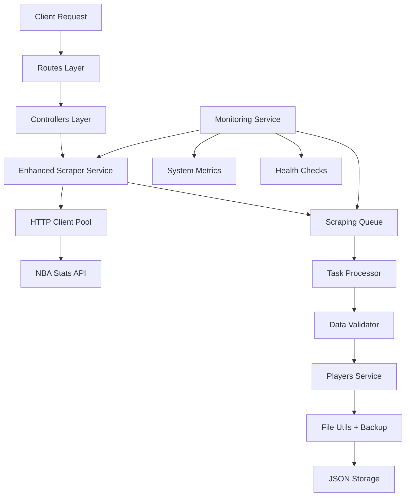

# NBA Players Scraper API - Complete Documentation

## 📋 Table of Contents
- [Project Overview](#project-overview)
- [Features](#features)
- [Architecture](#architecture)
- [Installation & Setup](#installation--setup)
- [Configuration](#configuration)
- [API Documentation](#api-documentation)
- [Usage Examples](#usage-examples)
- [Data Schema](#data-schema)
- [Production Deployment](#production-deployment)
- [Troubleshooting](#troubleshooting)
- [Development](#development)

## 🎯 Project Overview

The NBA Players Scraper API is a **production-ready** Node.js application that scrapes NBA player data from the official NBA.com API and provides a comprehensive RESTful API for data access and management. The project features both legacy and enhanced scraping capabilities with advanced error handling, monitoring, and backup systems.

### Technologies Used
- **Backend**: Node.js, Express.js
- **HTTP Client**: Axios with connection pooling
- **Data Storage**: JSON files with atomic operations
- **Authentication**: None (open API)
- **Monitoring**: Real-time metrics and health checks
- **Testing**: Custom test suite

### Key Capabilities
- ✅ Scrape 5,000+ NBA players data reliably
- ✅ Production-ready error handling and retry logic
- ✅ Real-time monitoring and progress tracking
- ✅ Automatic backup and recovery systems
- ✅ Data validation and integrity checks
- ✅ Queue-based processing with checkpoints
- ✅ RESTful API with comprehensive endpoints

## 🚀 Features

### Core Features
- **NBA Data Scraping**: Fetches current and historical NBA player data from official NBA Stats API
- **Dual Architecture**: Legacy (simple) and Enhanced (production-ready) endpoints
- **Local JSON Storage**: Stores data in JSON format with backup management
- **RESTful API**: Clean API endpoints for data access and management
- **Data Validation**: Robust validation and transformation pipeline
- **Error Handling**: Comprehensive error handling with logging

### Enhanced Features (Production-Ready)
- **Retry Logic**: Exponential backoff with intelligent error categorization
- **Connection Pooling**: HTTP keep-alive agents preventing ECONNRESET errors
- **Concurrency Control**: Queue-based processing with configurable limits
- **Real-time Monitoring**: Progress tracking, system metrics, and health checks
- **Backup System**: Versioned backups with automatic rotation
- **Checkpoint Recovery**: Resume scraping from interruption points
- **Duplicate Prevention**: Advanced deduplication with merge strategies

### Monitoring & Observability
- **Real-time Progress**: Track scraping progress with ETA calculations
- **System Metrics**: Memory usage, CPU load, connection pool stats
- **Health Checks**: Automatic issue detection and status reporting
- **Error Tracking**: Categorized error logging with detailed metrics

## 🏗️ Architecture

### Project Structure
```
nba-players-scraper/
├── package.json                 # Dependencies and scripts
├── .env.example                # Environment configuration template
├── README.md                   # Basic project documentation
├── ENHANCED_SCRAPING_GUIDE.md  # Detailed production guide
├── test-enhanced-scraping.js   # Test suite for enhanced features
└── src/
    ├── server.js               # Express server entry point
    ├── app.js                  # Application setup (if exists)
    ├── config/
    │   └── index.js           # Configuration management
    ├── controllers/
    │   ├── playersController.js      # Legacy player endpoints
    │   └── enhancedPlayersController.js # Enhanced endpoints
    ├── routes/
    │   ├── index.js           # Main router
    │   ├── players.js         # Legacy player routes
    │   └── enhancedPlayers.js # Enhanced routes
    ├── services/
    │   ├── nbaScraperService.js         # Legacy scraper
    │   ├── enhancedNbaScraperService.js # Production scraper
    │   ├── playersService.js            # Data management
    │   ├── httpClient.js               # Enhanced HTTP client
    │   ├── scrapingQueue.js            # Queue management
    │   └── monitoringService.js        # Metrics & monitoring
    ├── utils/
    │   ├── logger.js          # Logging utility
    │   ├── fileUtils.js       # File operations with backup
    │   └── validationUtils.js # Data validation
    ├── data/
    │   ├── players.json       # Main data storage
    │   └── *.backup.*         # Automatic backup files
    └── test/
        └── check.js           # Data verification script
```

### Service Architecture

#### Core Components
1. **HTTP Client Service** (`httpClient.js`)
   - Connection pooling with keep-alive
   - Exponential backoff retry logic
   - Request/response interceptors
   - Error categorization and handling

2. **Scraping Queue Service** (`scrapingQueue.js`)
   - Concurrent task processing
   - Checkpoint system for recovery
   - Progress tracking and statistics
   - Event-driven architecture

3. **Monitoring Service** (`monitoringService.js`)
   - System resource monitoring
   - Real-time progress tracking
   - Health status determination
   - Metrics collection and reporting

4. **Players Service** (`playersService.js`)
   - Data storage management
   - Backup and restore operations
   - Data validation and integrity
   - Duplicate detection and merging

### Data Flow



## 💻 Installation & Setup

### Prerequisites
- Node.js (v16 or higher)
- npm or yarn
- Windows, macOS, or Linux

### Quick Start

1. **Clone/Download the Project**
   ```bash
   # If using git
   git clone <repository-url>
   cd nba-players-scraper
   
   # Or download and extract the ZIP file
   ```

2. **Install Dependencies**
   ```bash
   npm install
   ```

3. **Configure Environment**
   ```bash
   # Copy environment template
   cp .env.example .env
   
   # Edit configuration (optional)
   # Default values work for most setups
   ```

4. **Start the Server**
   ```bash
   npm start
   ```

5. **Verify Installation**
   ```bash
   # Check API health
   curl http://localhost:3001/api/health
   
   # Run test suite
   node test-enhanced-scraping.js
   ```

### Development Setup

For development with auto-reload:
```bash
npm run dev
```

## ⚙️ Configuration

### Environment Variables (.env)

#### Server Configuration
```env
# Basic server settings
PORT=3001                    # Server port
NODE_ENV=development         # Environment mode
```

#### NBA API Configuration
```env
# API endpoints and delays
NBA_API_BASE_URL=https://www.nba.com/stats/players/list
NBA_PLAYERS_ENDPOINT=https://stats.nba.com/stats/playerindex
REQUEST_DELAY=1000          # Delay between requests (ms)
```

#### HTTP Client Configuration
```env
# Connection pooling settings
HTTP_TIMEOUT=30000          # Request timeout (30 seconds)
MAX_SOCKETS=10              # Max connections per host
MAX_FREE_SOCKETS=5          # Max idle connections
KEEP_ALIVE=true             # Enable keep-alive connections
KEEP_ALIVE_MSECS=30000      # Keep-alive timeout
```

#### Enhanced Scraping Configuration
```env
# Production scraping settings
SCRAPING_CONCURRENCY=3      # Concurrent requests (recommended: 2-5)
BATCH_SIZE=50               # Items per batch
CHECKPOINT_INTERVAL=100     # Save progress every N items
MAX_RETRIES=3               # Max retry attempts
RETRY_DELAY=1000            # Base retry delay (ms)
```

#### File Storage Configuration
```env
# Data storage paths
DATA_FILE_PATH=./src/data/players.json
BACKUP_PATH=./src/data/backups
CHECKPOINT_PATH=./src/data/.scraping-checkpoint.json
MAX_BACKUPS=10              # Keep last 10 backups
```

#### Monitoring Configuration
```env
# System monitoring
ENABLE_STATS=true           # Enable monitoring
STATS_INTERVAL=30000        # Monitoring interval (30 seconds)
ENABLE_DISK_SPACE=true      # Monitor disk usage
ENABLE_MEMORY=true          # Monitor memory usage
```

### Configuration Recommendations

#### For Development
```env
SCRAPING_CONCURRENCY=2      # Lower concurrency
REQUEST_DELAY=1500          # Slower requests
LOG_LEVEL=debug             # Detailed logging
```

#### For Production
```env
SCRAPING_CONCURRENCY=3      # Balanced performance
REQUEST_DELAY=1000          # Standard delay
LOG_LEVEL=info              # Standard logging
ENABLE_COMPRESSION=true     # Enable response compression
```

#### For High-Volume Scraping
```env
SCRAPING_CONCURRENCY=5      # Higher concurrency
REQUEST_DELAY=500           # Faster requests
HTTP_TIMEOUT=45000          # Longer timeout
MAX_RETRIES=5               # More retries
```

## 📚 API Documentation

### Base URL
```
http://localhost:3001/api
```

### Authentication
The API is currently open and does not require authentication.

---

### Core Endpoints

#### 1. Health Check
**GET** `/health`

Check API health status.

**Response:**
```json
{
  "success": true,
  "message": "NBA Players Scraper API is healthy",
  "timestamp": "2026-03-04T08:30:00.000Z",
  "version": "2.0.0-enhanced"
}
```

#### 2. API Information
**GET** `/`

Get API information and available endpoints.

**Response:**
```json
{
  "success": true,
  "message": "Welcome to Enhanced NBA Players Scraper API",
  "version": "2.0.0-enhanced",
  "endpoints": {
    "health": "GET /api/health",
    "scrape": "GET /api/enhanced/scrape",
    "players": "GET /api/enhanced"
  },
  "features": [
    "Production-ready scraping with retry logic",
    "Automatic backup and recovery",
    "Real-time monitoring and metrics"
  ]
}
```

---

### Enhanced Endpoints (Recommended)

#### 3. Start Enhanced Scraping
**GET** `/enhanced/scrape`

Start production-ready NBA players scraping with monitoring.

**Query Parameters:**
| Parameter | Type | Default | Description |
|-----------|------|---------|-------------|
| `strategy` | string | `skip` | Merge strategy: `skip`, `update`, `merge` |
| `updateExisting` | boolean | `false` | Update existing players with team changes |
| `preserveIds` | boolean | `true` | Preserve existing player IDs |
| `createBackup` | boolean | `true` | Create backup before scraping |

**Example:**
```bash
curl "http://localhost:3001/api/enhanced/scrape?strategy=update&updateExisting=true"
```

**Response:**
```json
{
  "success": true,
  "message": "Players scraped and stored successfully",
  "data": {
    "scraping": {
      "scrapedCount": 5118,
      "newPlayersAdded": 4973,
      "duplicatesSkipped": 145,
      "playersUpdated": 0,
      "totalPlayers": 5118
    },
    "stats": {
      "scraping": {
        "duration": 2247.5,
        "successRate": "100.0%",
        "itemsPerSecond": "2.28"
      }
    },
    "integrity": {
      "valid": 5118,
      "invalid": 0,
      "duplicates": 0
    }
  }
}
```

#### 4. Get Scraping Status
**GET** `/enhanced/scrape/status`

Get real-time scraping progress and status.

**Response:**
```json
{
  "success": true,
  "data": {
    "isActive": true,
    "scraperStats": {
      "totalPlayers": 5118,
      "processedPlayers": 2450,
      "successfulPlayers": 2450,
      "failedPlayers": 0,
      "queueStatus": {
        "queue": 2665,
        "processing": 3,
        "completed": 2450
      }
    },
    "healthStatus": {
      "status": "healthy",
      "issues": []
    }
  }
}
```

#### 5. Control Scraping
**POST** `/enhanced/scrape/control`

Control active scraping operations.

**Body:**
```json
{
  "action": "pause"   // "pause", "resume", "stop"
}
```

**Response:**
```json
{
  "success": true,
  "message": "Scraping paused",
  "data": {
    "action": "pause",
    "status": { /* current status */ }
  }
}
```

#### 6. Get Backup Information
**GET** `/enhanced/backups`

List all available backups.

**Response:**
```json
{
  "success": true,
  "data": {
    "currentFile": {
      "path": "./src/data/players.json",
      "size": 2485792,
      "exists": true
    },
    "backups": [
      {
        "name": "players.json.backup.2026-03-04T08-20-15-123Z",
        "size": 1245678,
        "created": "2026-03-04T08:20:15.123Z",
        "sizeFormatted": "1.19 MB"
      }
    ],
    "totalBackups": 5,
    "totalBackupSize": 6234567
  }
}
```

#### 7. Restore from Backup
**POST** `/enhanced/restore`

Restore data from a specific backup.

**Body Options:**

Option 1 - Specific backup:
```json
{
  "backupPath": "./src/data/players.json.backup.2026-03-04T08-20-15-123Z"
}
```

Option 2 - Auto-restore:
```json
{
  "autoRestore": true
}
```

**Response:**
```json
{
  "success": true,
  "message": "Restore completed successfully",
  "data": {
    "restoredFrom": "players.json.backup.2026-03-04T08-20-15-123Z",
    "playersRestored": 145,
    "timestamp": "2026-03-04T08:25:00.000Z"
  }
}
```

#### 8. Validate Data Integrity
**GET** `/enhanced/validate`

Perform data integrity validation.

**Response:**
```json
{
  "success": true,
  "data": {
    "totalPlayers": 5118,
    "validPlayers": 5115,
    "invalidPlayers": 3,
    "duplicateGroups": 2,
    "issues": [
      {
        "playerIndex": 1523,
        "playerId": "uuid-123",
        "playerName": "John Doe",
        "errors": ["Invalid height format"]
      }
    ]
  }
}
```

#### 9. Get Monitoring Metrics
**GET** `/enhanced/metrics`

Get comprehensive system and scraping metrics.

**Response:**
```json
{
  "success": true,
  "data": {
    "metrics": {
      "current": {
        "system": {
          "memory": {
            "used": 1482151936,
            "percentage": "87.5"
          },
          "cpu": {
            "loadAverage": [0.1, 0.2, 0.3]
          }
        },
        "scraping": {
          "itemsPerSecond": 2.5,
          "successRate": "98.7"
        },
        "http": {
          "totalRequests": 5234,
          "successfulRequests": 5167,
          "avgResponseTime": 450
        }
      }
    },
    "health": {
      "status": "healthy",
      "issues": []
    },
    "isScrapingActive": false
  }
}
```

#### 10. Get All Players (Enhanced)
**GET** `/enhanced`

Get all players with enhanced filtering and pagination.

**Query Parameters:**
| Parameter | Type | Description |
|-----------|------|-------------|
| `search` | string | Search in name and team |
| `team` | string | Filter by team |
| `position` | string | Filter by position |
| `isActive` | boolean | Filter by active status |
| `sortBy` | string | Sort field (default: `lastName`) |
| `sortOrder` | string | Sort order: `asc`, `desc` |
| `limit` | number | Items per page |
| `offset` | number | Pagination offset |

**Example:**
```bash
curl "http://localhost:3001/api/enhanced?search=lebron&sortBy=firstName&limit=10"
```

**Response:**
```json
{
  "success": true,
  "data": {
    "players": [
      {
        "id": "uuid-123",
        "firstName": "LeBron",
        "lastName": "James",
        "team": "Los Angeles Lakers",
        "position": "SF",
        "isActive": true,
        "height": "6'9\"",
        "weight": "113kg",
        "image": "https://cdn.nba.com/headshots/nba/latest/1040x760/2544.png"
      }
    ],
    "pagination": {
      "total": 1,
      "limit": 10,
      "offset": 0,
      "hasMore": false
    }
  }
}
```

---

### Legacy Endpoints (Backward Compatibility)

#### 11. Legacy Scraping
**GET** `/players/scrape`

Simple scraping without enhanced features.

#### 12. Get Players (Legacy)
**GET** `/players`

Get all players with basic filtering.

#### 13. Search Players
**GET** `/players/search`

Search players with specific criteria.

#### 14. Get Player by ID
**GET** `/players/:id`

Get specific player information.

#### 15. Get Player Statistics
**GET** `/players/stats`

Get data statistics and counts.

#### 16. Clear All Players
**DELETE** `/players`

Delete all player data.

---

### Error Responses

All endpoints return errors in this format:
```json
{
  "success": false,
  "message": "Error description",
  "error": "Detailed error message",
  "timestamp": "2026-03-04T08:30:00.000Z"
}
```

**Common HTTP Status Codes:**
- `200` - Success
- `400` - Bad Request
- `404` - Not Found
- `409` - Conflict (e.g., scraping already in progress)
- `500` - Internal Server Error

## 💾 Data Schema

### Player Object Structure

```json
{
  "id": "550e8400-e29b-41d4-a716-446655440000",
  "firstName": "LeBron",
  "lastName": "James",
  "team": "Los Angeles Lakers",
  "era": "2020s",
  "position": "SF",
  "image": "https://cdn.nba.com/headshots/nba/latest/1040x760/2544.png",
  "height": "6'9\"",
  "weight": "113kg",
  "birthDate": "1984-12-30",
  "nationality": "USA",
  "yearsActive": "2003-present",
  "championships": 4,
  "biography": null,
  "avgPoints": null,
  "avgRebounds": null,
  "avgAssists": null,
  "difficulty": 1,
  "isActive": true,
  "addedBy": null,
  "createdAt": "2026-03-04T08:30:00.000Z",
  "updatedAt": "2026-03-04T08:30:00.000Z"
}
```

### Field Descriptions

| Field | Type | Description |
|-------|------|-------------|
| `id` | string | Unique UUID identifier |
| `firstName` | string | Player's first name |
| `lastName` | string | Player's last name |
| `team` | string | Current team name |
| `era` | string | Playing era (default: "2020s") |
| `position` | string | Playing position (PG, SG, SF, PF, C) |
| `image` | string | Player headshot URL |
| `height` | string | Player height in feet/inches |
| `weight` | string | Player weight in kg |
| `birthDate` | string | Birth date (ISO format) |
| `nationality` | string | Player's nationality |
| `yearsActive` | string | Years active in NBA |
| `championships` | number | Number of championships won |
| `biography` | string/null | Player biography (future feature) |
| `avgPoints` | number/null | Average points (future feature) |
| `avgRebounds` | number/null | Average rebounds (future feature) |
| `avgAssists` | number/null | Average assists (future feature) |
| `difficulty` | number | Difficulty rating (1-5) |
| `isActive` | boolean | Currently active in NBA |
| `addedBy` | string/null | Who added the player |
| `createdAt` | string | Creation timestamp |
| `updatedAt` | string | Last update timestamp |

### Data Storage

- **Format**: JSON
- **Location**: `./src/data/players.json`
- **Backup**: Automatic versioned backups
- **Validation**: Schema validation on save
- **Encoding**: UTF-8

## 🌟 Usage Examples

### Basic Scraping Workflow

```bash
# 1. Start the server
npm start

# 2. Check API health
curl http://localhost:3001/api/health

# 3. Start enhanced scraping
curl "http://localhost:3001/api/enhanced/scrape"

# 4. Monitor progress (in another terminal)
curl "http://localhost:3001/api/enhanced/scrape/status"

# 5. Check saved data
curl "http://localhost:3001/api/enhanced?limit=5"
```

### Production Scraping with Options

```bash
# Scrape with update strategy and backup
curl "http://localhost:3001/api/enhanced/scrape?strategy=update&updateExisting=true&createBackup=true"
```

### Monitoring and Control

```bash
# Get real-time metrics
curl "http://localhost:3001/api/enhanced/metrics"

# Pause scraping if needed
curl -X POST "http://localhost:3001/api/enhanced/scrape/control" \
  -H "Content-Type: application/json" \
  -d '{"action": "pause"}'

# Resume scraping
curl -X POST "http://localhost:3001/api/enhanced/scrape/control" \
  -H "Content-Type: application/json" \
  -d '{"action": "resume"}'
```

### Backup Management

```bash
# List all backups
curl "http://localhost:3001/api/enhanced/backups"

# Restore from latest backup
curl -X POST "http://localhost:3001/api/enhanced/restore" \
  -H "Content-Type: application/json" \
  -d '{"autoRestore": true}'

# Restore from specific backup
curl -X POST "http://localhost:3001/api/enhanced/restore" \
  -H "Content-Type: application/json" \
  -d '{"backupPath": "./src/data/players.json.backup.2026-03-04T08-20-15-123Z"}'
```

### Data Validation and Search

```bash
# Validate data integrity
curl "http://localhost:3001/api/enhanced/validate"

# Search for players
curl "http://localhost:3001/api/enhanced?search=james&team=lakers"

# Get players with pagination
curl "http://localhost:3001/api/enhanced?limit=20&offset=40&sortBy=firstName"

# Filter active players
curl "http://localhost:3001/api/enhanced?isActive=true&position=PG"
```

### JavaScript/Node.js Integration

```javascript
const axios = require('axios');

class NBAPlayersAPI {
  constructor(baseURL = 'http://localhost:3001/api') {
    this.baseURL = baseURL;
  }

  // Start scraping
  async scrapeData(options = {}) {
    const params = new URLSearchParams(options);
    const response = await axios.get(`${this.baseURL}/enhanced/scrape?${params}`);
    return response.data;
  }

  // Get players with filtering
  async getPlayers(filters = {}) {
    const params = new URLSearchParams(filters);
    const response = await axios.get(`${this.baseURL}/enhanced?${params}`);
    return response.data;
  }

  // Monitor scraping progress
  async getStatus() {
    const response = await axios.get(`${this.baseURL}/enhanced/scrape/status`);
    return response.data;
  }

  // Search players
  async searchPlayers(query, options = {}) {
    const params = new URLSearchParams({ search: query, ...options });
    const response = await axios.get(`${this.baseURL}/enhanced?${params}`);
    return response.data;
  }
}

// Usage example
const api = new NBAPlayersAPI();

async function example() {
  // Start scraping
  const scrapeResult = await api.scrapeData({
    strategy: 'update',
    updateExisting: true
  });

  // Search for Lakers players
  const lakersPlayers = await api.searchPlayers('lakers', {
    limit: 10,
    sortBy: 'lastName'
  });

  console.log(`Found ${lakersPlayers.data.players.length} Lakers players`);
}
```

### Testing Integration

```javascript
// test-integration.js
const axios = require('axios');

async function runIntegrationTests() {
  const baseURL = 'http://localhost:3001/api';

  try {
    // Test health check
    const health = await axios.get(`${baseURL}/health`);
    console.log('✅ Health check:', health.data.success);

    // Test player retrieval
    const players = await axios.get(`${baseURL}/enhanced?limit=1`);
    console.log('✅ Player retrieval:', players.data.success);

    // Test search
    const search = await axios.get(`${baseURL}/enhanced?search=james&limit=1`);
    console.log('✅ Search functionality:', search.data.success);

    console.log('🎉 All integration tests passed!');
  } catch (error) {
    console.error('❌ Integration test failed:', error.message);
  }
}

runIntegrationTests();
```

## 🚀 Production Deployment

### Performance Optimization

1. **Environment Configuration**
   ```env
   NODE_ENV=production
   LOG_LEVEL=warn
   ENABLE_COMPRESSION=true
   ```

2. **Process Management**
   ```bash
   # Using PM2 for process management
   npm install -g pm2
   pm2 start src/server.js --name "nba-scraper"
   pm2 startup
   pm2 save
   ```

3. **Reverse Proxy (Nginx)**
   ```nginx
   server {
       listen 80;
       server_name your-domain.com;

       location / {
           proxy_pass http://localhost:3001;
           proxy_http_version 1.1;
           proxy_set_header Upgrade $http_upgrade;
           proxy_set_header Connection 'upgrade';
           proxy_set_header Host $host;
           proxy_cache_bypass $http_upgrade;
       }
   }
   ```

### Monitoring in Production

1. **Health Check Endpoint**
   ```bash
   # Add to monitoring system
   curl -f http://localhost:3001/api/health || exit 1
   ```

2. **Log Management**
   ```bash
   # Centralized logging
   pm2 logs nba-scraper --lines 100
   ```

3. **Resource Monitoring**
   ```bash
   # Monitor system resources
   curl "http://localhost:3001/api/enhanced/metrics"
   ```

### Security Considerations

1. **Environment Variables**
   - Store sensitive configuration in environment variables
   - Never commit `.env` files to version control

2. **API Rate Limiting**
   ```javascript
   // Add rate limiting middleware (optional)
   const rateLimit = require("express-rate-limit");

   const limiter = rateLimit({
     windowMs: 15 * 60 * 1000, // 15 minutes
     max: 100 // limit each IP to 100 requests per windowMs
   });

   app.use('/api', limiter);
   ```

3. **CORS Configuration**
   ```javascript
   // Production CORS settings
   app.use(cors({
     origin: ['https://your-frontend-domain.com'],
     credentials: true
   }));
   ```

### Database Migration (Optional)

For large-scale deployments, consider migrating from JSON to a database:

```javascript
// Example PostgreSQL migration
const { Pool } = require('pg');

const pool = new Pool({
  connectionString: process.env.DATABASE_URL
});

// Migrate JSON data to PostgreSQL
async function migrateToDatabase() {
  const jsonData = await FileUtils.readJsonFile('./src/data/players.json');
  
  for (const player of jsonData) {
    await pool.query(
      'INSERT INTO players (id, first_name, last_name, team, ...) VALUES ($1, $2, $3, $4, ...)',
      [player.id, player.firstName, player.lastName, player.team, ...]
    );
  }
}
```

## 🔧 Troubleshooting

### Common Issues and Solutions

#### 1. Server Won't Start

**Error**: `Error: listen EADDRINUSE: address already in use :::3001`

**Solution**:
```bash
# Check what's using the port
netstat -ano | findstr :3001

# Kill the process or change port in .env
PORT=3002
```

#### 2. Scraping Fails with ECONNRESET

**Error**: `ECONNRESET` or connection errors

**Solution**: This is automatically handled by the enhanced scraper, but you can adjust settings:
```env
# Reduce concurrency
SCRAPING_CONCURRENCY=2

# Increase delays
REQUEST_DELAY=2000

# Increase timeout
HTTP_TIMEOUT=45000
```

#### 3. Memory Issues

**Error**: High memory usage or out of memory

**Solution**:
```env
# Reduce batch size
BATCH_SIZE=25

# Reduce concurrency
SCRAPING_CONCURRENCY=2
```

#### 4. Data Corruption

**Error**: JSON file corrupted or unreadable

**Solution**:
```bash
# Auto-restore from backup
curl -X POST "http://localhost:3001/api/enhanced/restore" \
  -H "Content-Type: application/json" \
  -d '{"autoRestore": true}'

# Or list backups and restore manually
curl "http://localhost:3001/api/enhanced/backups"
```

#### 5. Scraping Stalls

**Error**: Scraping stops making progress

**Solution**:
```bash
# Check scraping status
curl "http://localhost:3001/api/enhanced/scrape/status"

# If stalled, stop and restart
curl -X POST "http://localhost:3001/api/enhanced/scrape/control" \
  -H "Content-Type: application/json" \
  -d '{"action": "stop"}'

# Wait a moment, then restart
curl "http://localhost:3001/api/enhanced/scrape"
```

#### 6. High Error Rates

**Error**: Many HTTP errors or timeouts

**Solution**:
```bash
# Check error details
curl "http://localhost:3001/api/enhanced/metrics"

# Adjust settings for more conservative scraping
```

### Debug Mode

Enable debug logging:
```env
LOG_LEVEL=debug
NODE_ENV=development
```

Run diagnostic tests:
```bash
node test-enhanced-scraping.js
```

### Log Analysis

Check logs for common patterns:
```bash
# Look for error patterns
grep "ERROR" logs/app.log | tail -20

# Check success rates
grep "Progress:" logs/app.log | tail -10
```

### Performance Tuning

Monitor and adjust based on performance:
```bash
# Get current metrics
curl "http://localhost:3001/api/enhanced/metrics"

# Adjust configuration based on:
# - Success rate (target: >95%)
# - Average response time (target: <1000ms)
# - Memory usage (target: <80%)
```

## 👩‍💻 Development

### Setting Up Development Environment

1. **Install Development Dependencies**
   ```bash
   npm install --include=dev
   ```

2. **Run in Development Mode**
   ```bash
   npm run dev  # Uses nodemon for auto-reload
   ```

3. **Run Tests**
   ```bash
   # Run full test suite
   node test-enhanced-scraping.js

   # Test specific components
   node test-enhanced-scraping.js http
   node test-enhanced-scraping.js backup
   node test-enhanced-scraping.js monitoring
   ```

### Code Structure Guidelines

#### Service Layer Pattern
```javascript
// services/exampleService.js
class ExampleService {
  constructor(options) {
    this.options = options;
  }

  async performAction() {
    // Implementation
  }
}
```

#### Controller Pattern
```javascript
// controllers/exampleController.js
class ExampleController {
  constructor() {
    this.exampleService = new ExampleService();
  }

  async handleRequest(req, res) {
    try {
      const result = await this.exampleService.performAction();
      res.json({ success: true, data: result });
    } catch (error) {
      res.status(500).json({ success: false, error: error.message });
    }
  }
}
```

#### Error Handling Pattern
```javascript
// Always use try-catch with proper logging
try {
  await someAsyncOperation();
  Logger.success("Operation completed");
} catch (error) {
  Logger.error("Operation failed:", error.message);
  throw new Error("User-friendly error message");
}
```

### Adding New Features

#### 1. Create Service
```javascript
// src/services/newFeatureService.js
class NewFeatureService {
  async newMethod() {
    // Implementation
  }
}
```

#### 2. Create Controller
```javascript
// src/controllers/newFeatureController.js
class NewFeatureController {
  async handleNewFeature(req, res) {
    // Implementation
  }
}
```

#### 3. Add Routes
```javascript
// src/routes/newFeature.js
router.get('/new-feature', controller.handleNewFeature);
```

#### 4. Update Documentation
- Add to API documentation
- Update usage examples
- Include in test suite

### Testing Guidelines

#### Unit Testing
```javascript
// test/unit/serviceTest.js
const ExampleService = require('../../src/services/exampleService');

describe('ExampleService', () => {
  it('should perform action correctly', async () => {
    const service = new ExampleService();
    const result = await service.performAction();
    expect(result).toBeDefined();
  });
});
```

#### Integration Testing
```javascript
// test/integration/apiTest.js
const request = require('supertest');
const app = require('../../src/server');

describe('API Integration', () => {
  it('should return health status', async () => {
    const response = await request(app).get('/api/health');
    expect(response.status).toBe(200);
  });
});
```

### Contributing

1. **Fork the Repository**
2. **Create Feature Branch**
   ```bash
   git checkout -b feature/new-feature
   ```
3. **Make Changes**
4. **Run Tests**
   ```bash
   node test-enhanced-scraping.js
   ```
5. **Submit Pull Request**

### Version Control

#### Commit Message Format
```
type(scope): description

- feat: new feature
- fix: bug fix
- docs: documentation update
- refactor: code refactoring
- test: test updates
```

Example:
```
feat(scraping): add playoff statistics endpoint

- Add new endpoint for playoff stats
- Include validation and tests
- Update documentation
```

---

## 📄 License

This project is licensed under the ISC License. See the LICENSE file for details.

## 🤝 Support

For issues, questions, or contributions:

1. **Check Documentation**: Review this documentation and the Enhanced Scraping Guide
2. **Run Diagnostics**: Use `node test-enhanced-scraping.js` for troubleshooting
3. **Check Logs**: Monitor application logs for detailed error information
4. **GitHub Issues**: Create an issue with detailed reproduction steps
5. **API Status**: Check `/api/health` and `/api/enhanced/metrics` endpoints

---

*Last Updated: March 4, 2026*